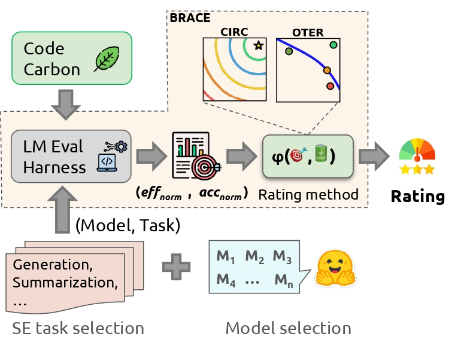
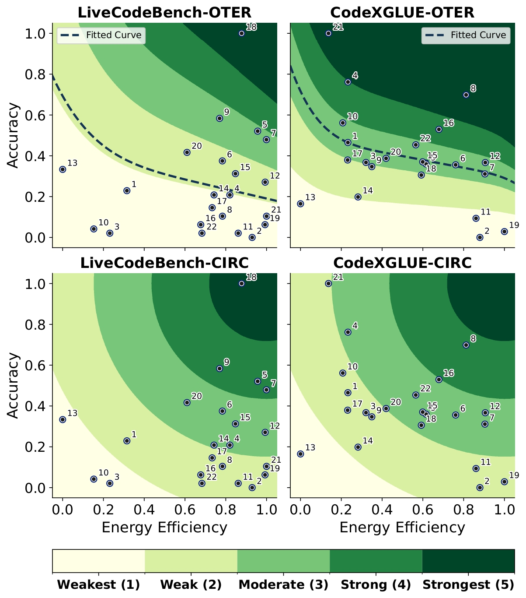
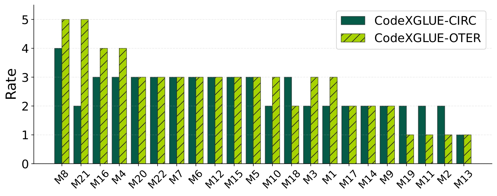
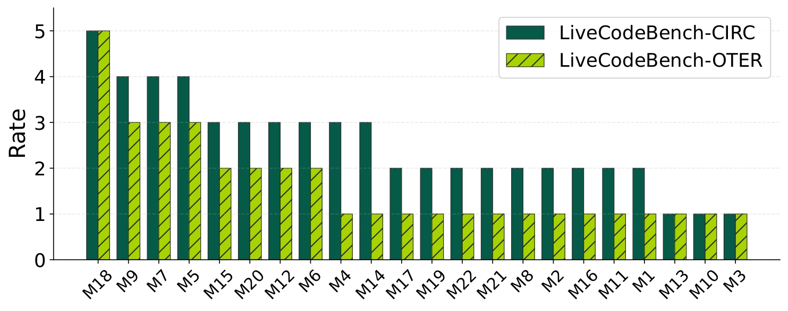
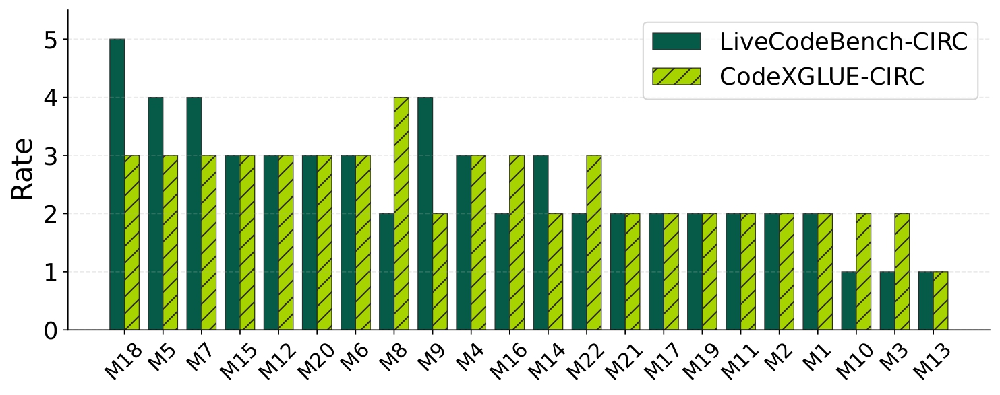
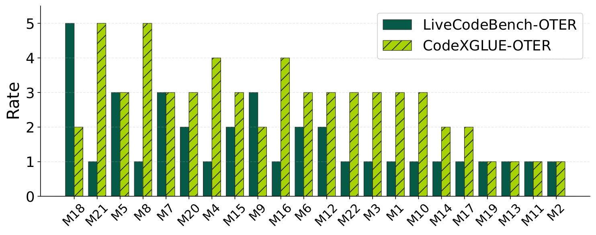

# BRACE: Unified Benchmarking of Accuracy and Energy for Code Language Models


## Overview
This repository contains the replication package for our study titled, BRACE. We aim to benchmark energy consumption and functional correctness of code language models on software engineering related tasks. Specifcally, We experimented with 22 huggingface models on two SE benchmarks, [LiveCodeBench](https://livecodebench.github.io/) and [CodeXGLUE-CodeSummarization](https://github.com/microsoft/CodeXGLUE).



<br></br>

> **Abstract**: The rapid advancement of AI technologies and their accelerated adoption in software development necessitates a systematic evaluation of their environmental impact alongside functional correctness. 
While prior studies have examined sustainability in large language models, existing approaches lack systematic frameworks for evaluating accuracy-energy trade-offs in Code Language Models (*CLMs*).
In this paper, we present a framework, **BRACE**, to benchmark *CLMs* on a unified scale of energy efficiency and functional correctness (referred to as accuracy).
We benchmark 22 state-of-the-art models on code generation and summarization tasks, proposing two rating methods: Concentric Incremental Rating Circles (CIRC) and Observation to Expectation Rating (OTER). 
CIRC provides deterministic Euclidean-based rankings with static trade-offs that are robust to outliers, and OTER offers trend-aware evaluation with dynamic trade-offs that capture the complex correlation between energy and accuracy, each offering a distinct perspective and addressing the problem in a unique way. These rating methods enable us to rate LLMs on a 1-5 scale reflecting their combined capabilities in terms of energy efficiency and functional correctness. 
Our analysis reveals models generally perform better in the code summarization tasks as they are not enforced to generate a grammar-based and syntactically correct output. Also, we find that models' size does not have a significant impact on their ratings, indicating that if models utilize their parameters efficiently, they can be ranked higher on these scales. 


### Repository Map

high-level map of the most relevant parts of the repo

```
├── RQs_implementation
│   ├── Motivation
│   └── RQ
├── lm_eval
│   ├── configs.py
│   ├── main_run.py
│   ├── models
│   │   └── huggingface.py
│   ├── rating_llms
│   ├── results
│   ├── run_config.yaml
│   ├── tasks
│   │   ├── code_x_glue
│   │   └── LiveCodeBench
```

- **RQ_implementation**: Study-specific materials.
  - [Motivation](RQ_implementation/Motivation/) — background and rationale.
  - Research Questions: [RQ](RQ_implementation/RQ/). [Statistical analysis](RQ_implementation/RQ/validation.ipynb)
- **lm_eval**: BRACE entry points and core library.
  - [configs.py](lm_eval/configs.py) — CLI/config plumbing and defaults.
  - [main_run.py](lm_eval/main_run.py) — main executable entry for experiments.
  - [models/](lm_eval/models/) — model backends; e.g., [huggingface.py](lm_eval/models/huggingface.py).
  - [rating_llms/](lm_eval/rating_llms/) — OTER and CIRC approach to rate LLMs. 
  - [results/](lm_eval/results/) — saved results and logs.
  - [run_config.yaml](lm_eval/run_config.yaml) — example run configuration.
  - [tasks/](lm_eval/tasks/) — benchmark/task definitions:
    - Code tasks: [code_x_glue](lm_eval/tasks/code_x_glue/)
    - Live coding benchmarks: [LiveCodeBench](lm_eval/tasks/LiveCodeBench/)
 

## Install
```
git clone https://github.com/tmp351/BRACE.git
cd BRACE
python3 -m venv venv
source venv/bin/activate
pip install -e .
```

## Usage Steps
- First you need to create `.env` file with your Huggingface API token in this format `HF_TOKEN=YOUR_TOKEN`.
- `cd lm_eval`
- Then you need to configure `run_config.yaml` file to specify the models and benchmarks.
    - `model`: This tag should be set to `hf` because our main goal is to run base models without any optimizations
    - `tasks`: You can extract the list of tasks with `lm-eval --tasks list` command.
    - `model_args`: Any argument that `AutoModel.from_pretrained` of huggingface takes.
    - `bnb_config`: for each model you define in `model_args`, you should specify a bnb tag that lets model know if it needs to quantize the model with bitsandbytes quantization. For instance, you can set `load_in_4bit=True`. The `model_args` and `bnb_config` lists are index-aligned, such that each model configuration corresponds to its respective quantization setting.
    - `experiments_run`: Simple tag to determine the purpose of your project. It will be stored in the final results file so you can extract and filter your results.
- Then you can run the command the `python main_run.py`. Each model specified in the yaml file will run sequentially on one task a time.
- The final results will be stored in `results/results.jsonl`. Also, if you need to take a look at each model specific energy log by codecarbon, you can view `codecarbon_log/{task_name}/{model_name}/{model_stage}.log`
- After generating results, you can rate your LLMs on a benchmark by running `python rating_llms/{approach}.py --task_name {task_name} --file_name {file_name}` where `task_name` is the tasks you specified in `run_config.yaml` and `file_name` will point to default generated `results.jsonl` file unless you specify. The results of ranking will be stored in `rating_llm/data` 

## Results
### Models Rating on LiveCodeBench and CodeXGLUE
<!-- ``` -->
| ID  | Model                                | LCB_Accuracy | LCB_Efficiency | CXG_Accuracy | CXG_Efficiency | LCB_CIRC | LCB_OTER | CXG_CIRC | CXG_OTER |
|-----|--------------------------------------|--------------|----------------|--------------|----------------|---------------|---------------|---------------|---------------|
| M1  | deepseek-coder-6.7b-base              | 0.23         | 0.32           | 0.47         | 0.23           | 2             | 1             | 2             | 3             |
| M2  | starcoderbase-1b                       | 0.00         | 0.93           | 0.00         | 0.88           | 2             | 1             | 2             | 1             |
| M3  | starcoder2-3b                         | 0.02         | 0.23           | 0.37         | 0.32           | 1             | 1             | 2             | 3             |
| M4  | CodeLlama-7b-Instruct-hf              | 0.21         | 0.82           | 0.76         | 0.23           | 3             | 1             | 3             | 4             |
| M5  | Qwen2.5-Coder-3B-Instruct              | 0.52         | 0.96           | 0.36         | 0.62           | 4             | 3             | 3             | 3             |
| M6  | Qwen2.5-Coder-7B-Instruct             | 0.38         | 0.78           | 0.36         | 0.76           | 3             | 2             | 3             | 3             |
| M7  | Qwen2.5-Coder-1.5B                     | 0.48         | 1.00           | 0.31         | 0.90           | 4             | 3             | 3             | 3             |
| M8  | deepseek-coder-1.3b-base               | 0.10         | 0.78           | 0.70         | 0.81           | 2             | 1             | 4             | 5             |
| M9  | deepseek-coder-7b-instruct-v1.5       | 0.58         | 0.77           | 0.35         | 0.35           | 4             | 3             | 2             | 2             |
| M10 | starcoder2-7b                         | 0.04         | 0.15           | 0.56         | 0.21           | 1             | 1             | 2             | 3             |
| M11 | codegen-350M-mono                    | 0.02         | 0.86           | 0.09         | 0.86           | 2             | 1             | 2             | 1             |
| M12 | Qwen2.5-Coder-0.5B                   | 0.27         | 0.99           | 0.37         | 0.91           | 3             | 2             | 3             | 3             |
| M13 | Yi-Coder-9B                           | 0.33         | 0.00           | 0.16         | 0.00           | 1             | 1             | 1             | 1             |
| M14 | rombos_Replete-Coder-Llama3-8B        | 0.21         | 0.74           | 0.20         | 0.28           | 3             | 1             | 2             | 2             |
| M15 | speechless-code-mistral-7b-v1.0       | 0.31         | 0.85           | 0.37         | 0.60           | 3             | 2             | 3             | 3             |
| M16 | stable-code-3b                         | 0.06         | 0.68           | 0.53         | 0.68           | 2             | 1             | 3             | 4             |
| M17 | CodeLlama-7b-Python-hf                | 0.15         | 0.73           | 0.38         | 0.23           | 2             | 1             | 2             | 2             |
| M18 | Seed-Coder-8B-Instruct                | 1.00         | 0.88           | 0.31         | 0.59           | 5             | 5             | 3             | 2             |
| M19 | CodeQwen1.5-7B-Chat                   | 0.06         | 0.99           | 0.03         | 1.00           | 2             | 1             | 2             | 1             |
| M20 | Magicoder-S-DS-6.7B                   | 0.42         | 0.61           | 0.39         | 0.42           | 3             | 2             | 3             | 3             |
| M21 | granite-8b-code-base-4k               | 0.10         | 1.00           | 1.00         | 0.14           | 2             | 1             | 2             | 5             |
| M22 | codegen-2B-mono                        | 0.02         | 0.68           | 0.45         | 0.57           | 2             | 1             | 3             | 3             |
<!-- ``` -->

### Results of OTER and CIRC Rating on Benchmarks 
These plots illustrate the ratings of models on each task-method pair. Also they show the distribution of model ratings across different energy–accuracy combinations.
Each contour region represents how models with similar trade-offs between energy efficiency and accuracy are rated within that range.  
<br></br>


<br></br>
### Pairwise Variance of Benchmarks and Rating Methods

The first row of the following plots demonstrate the how OTER and CIRC behave differently across tasks. While the second row indicate how tasks impact the rating of models for each technique.
<table>
  <tr>
    <td></td>
    <td></td>
  </tr>
  <tr>
    <td></td>
    <td></td>
  </tr>
</table>


### Experimented Models for BRACE:
- [deepseek-ai/deepseek-coder-6.7b-base](https://huggingface.co/deepseek-ai/deepseek-coder-6.7b-base)
- [bigcode/starcoderbase-1b](https://huggingface.co/bigcode/starcoderbase-1b)
- [bigcode/starcoder2-3b](https://huggingface.co/bigcode/starcoder2-3b)
- [codellama/CodeLlama-7b-Instruct-hf](https://huggingface.co/codellama/CodeLlama-7b-Instruct-hf)
- [Qwen/Qwen2.5-Coder-3B-Instruct](https://huggingface.co/Qwen/Qwen2.5-Coder-3B-Instruct)
- [Qwen/Qwen2.5-Coder-7B-Instruct](https://huggingface.co/Qwen/Qwen2.5-Coder-7B-Instruct)
- [Qwen/Qwen2.5-Coder-1.5B](https://huggingface.co/Qwen/Qwen2.5-Coder-1.5B)
- [deepseek-ai/deepseek-coder-1.3b-base](https://huggingface.co/deepseek-ai/deepseek-coder-1.3b-base)
- [deepseek-ai/deepseek-coder-7b-instruct-v1.5](https://huggingface.co/deepseek-ai/deepseek-coder-7b-instruct-v1.5)
- [bigcode/starcoder2-7b](https://huggingface.co/bigcode/starcoder2-7b)
- [Salesforce/codegen-350M-mono](https://huggingface.co/Salesforce/codegen-350M-mono)
- [Qwen/Qwen2.5-Coder-0.5B](https://huggingface.co/Qwen/Qwen2.5-Coder-0.5B)
- [01-ai/Yi-Coder-9B](https://huggingface.co/01-ai/Yi-Coder-9B)
- [rombodawg/rombos_Replete-Coder-Llama3-8B](https://huggingface.co/rombodawg/rombos_Replete-Coder-Llama3-8B)
- [uukuguy/speechless-code-mistral-7b-v1.0](https://huggingface.co/uukuguy/speechless-code-mistral-7b-v1.0)
- [stabilityai/stable-code-3b](https://huggingface.co/stabilityai/stable-code-3b)
- [codellama/CodeLlama-7b-Python-hf](https://huggingface.co/codellama/CodeLlama-7b-Python-hf)
- [ByteDance-Seed/Seed-Coder-8B-Instruct](https://huggingface.co/ByteDance-Seed/Seed-Coder-8B-Instruct)
- [Qwen/CodeQwen1.5-7B-Chat](https://huggingface.co/Qwen/CodeQwen1.5-7B-Chat)
- [ise-uiuc/Magicoder-S-DS-6.7B](https://huggingface.co/ise-uiuc/Magicoder-S-DS-6.7B)
- [ibm-granite/granite-8b-code-base-4k](https://huggingface.co/ibm-granite/granite-8b-code-base-4k)
- [Salesforce/codegen-2B-mono](https://huggingface.co/Salesforce/codegen-2B-mono)


#### Credit
- [LM-Evaluation-Harness](https://github.com/EleutherAI/lm-evaluation-harness)
- [CodeCarbon](https://github.com/mlco2/codecarbon)
- [LiveCodeBench](https://github.com/EleutherAI/lm-evaluation-harness/pull/3078)